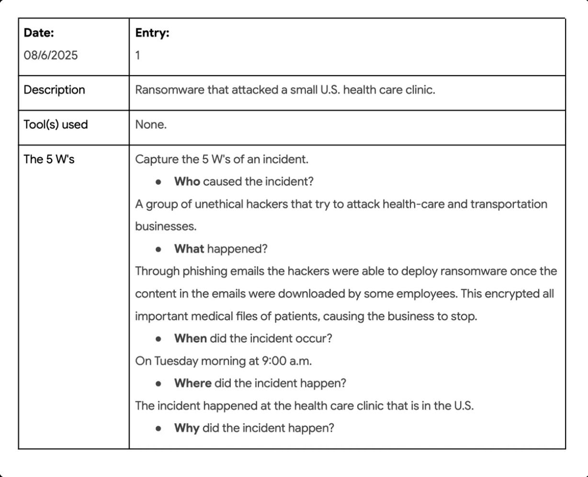
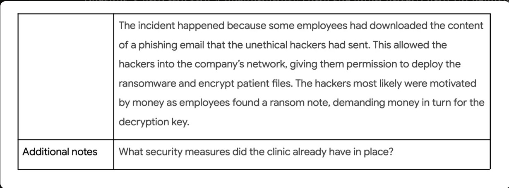
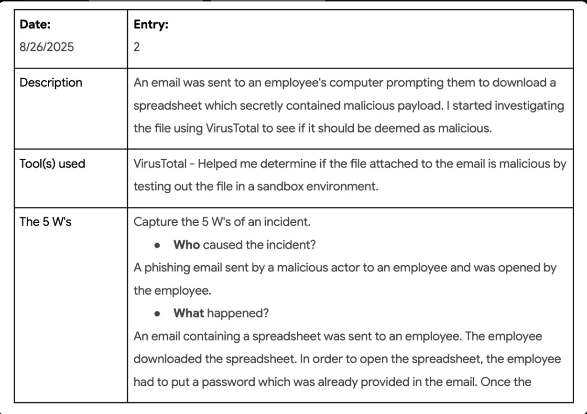
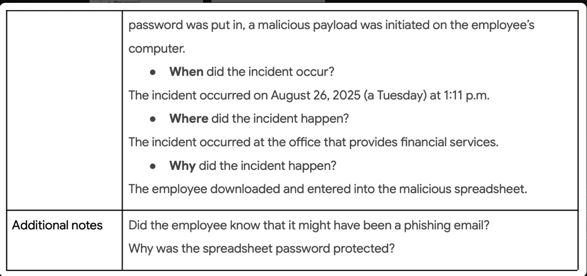
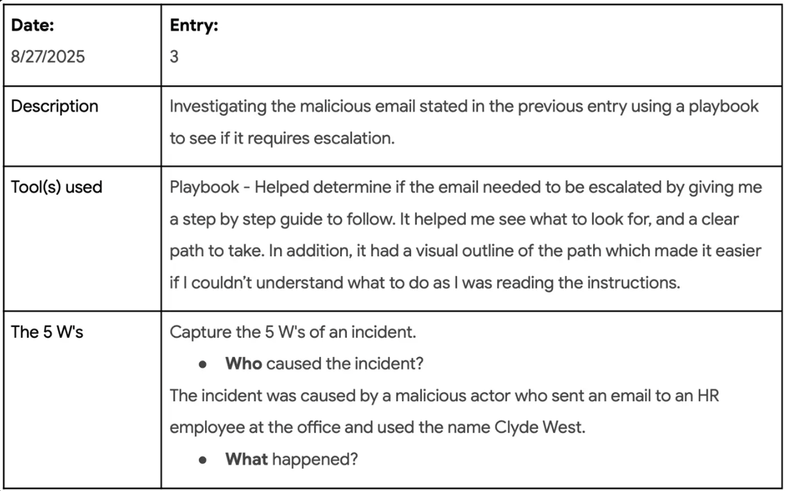
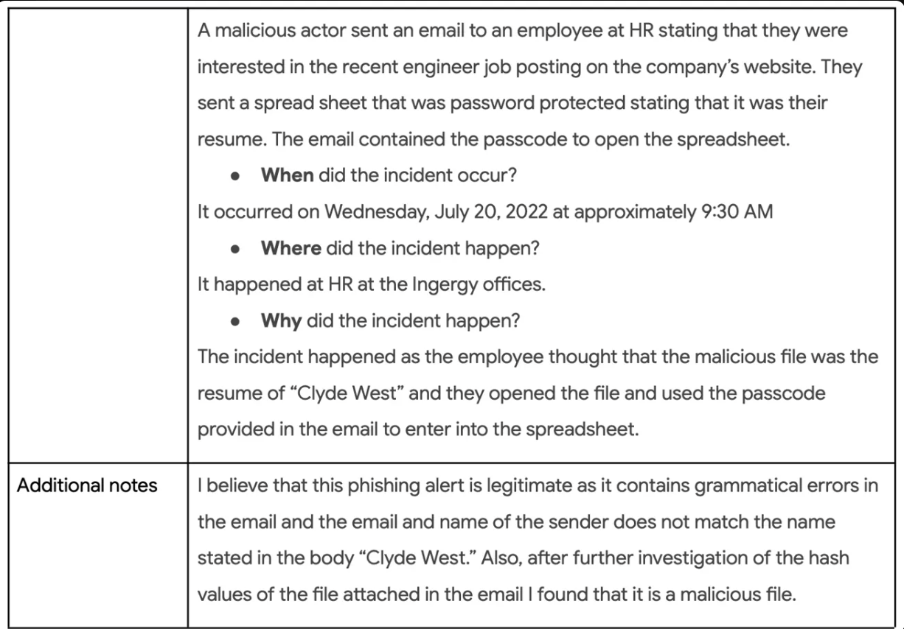
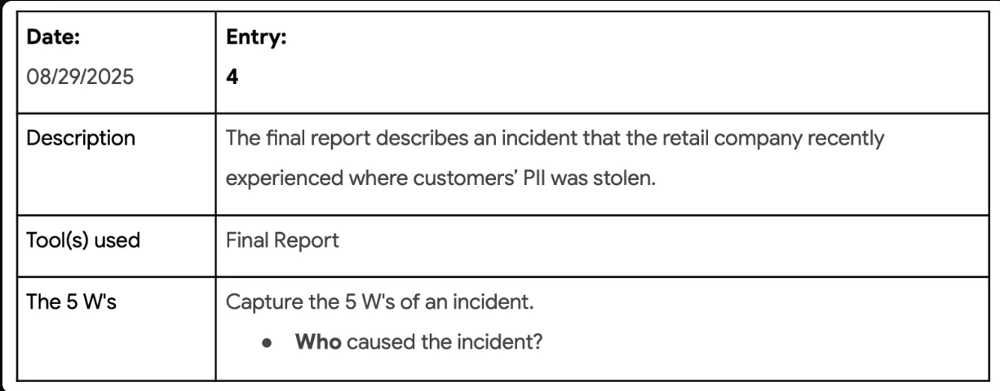
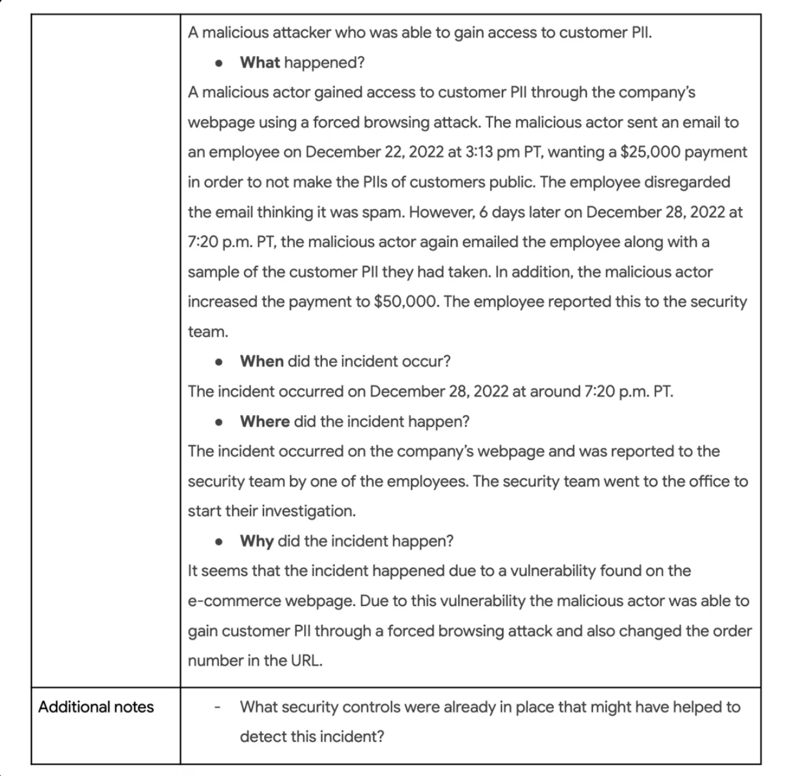
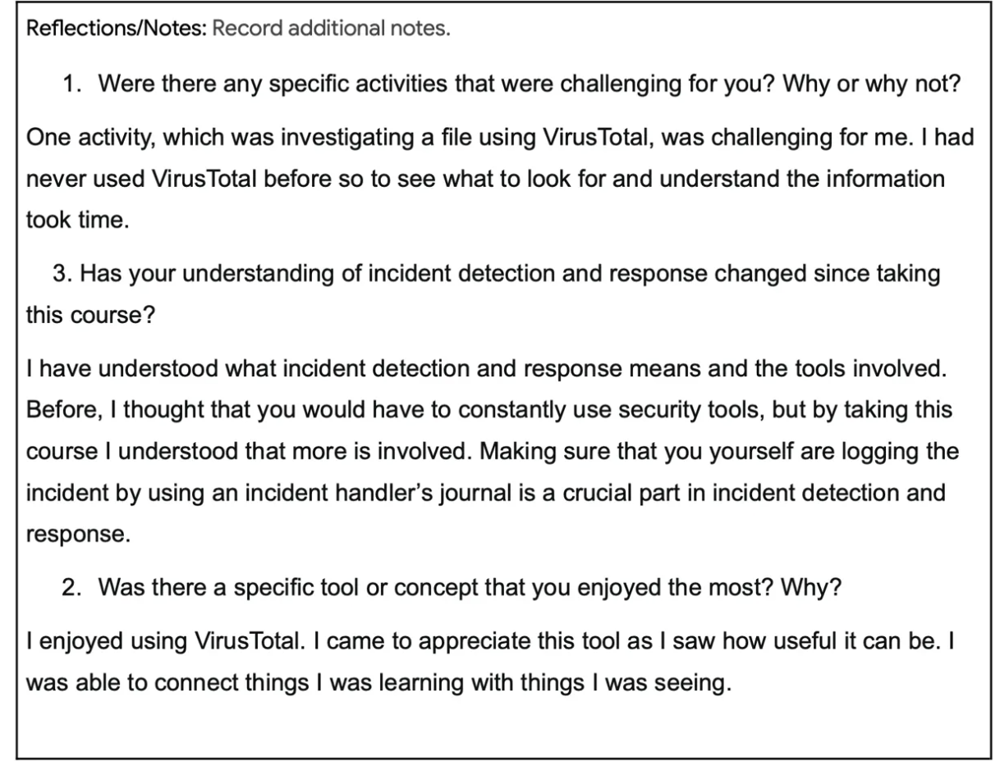

# Incident Handler's Journal

## Project Description
This journal documents my hands-on experience investigating and responding to various cybersecurity incidents as part of my security analyst training. Through these entries, I practiced the essential skill of documenting security incidents using the 5 W's framework (Who, What, When, Where, Why) and learned to use various security tools for incident detection and response. This journal serves as both a learning record and a demonstration of my ability to systematically analyze and document security incidents.

## What I Learned
- How to properly document security incidents using the 5 W's framework for comprehensive incident analysis
- The critical importance of maintaining an incident handler's journal for tracking patterns and supporting investigations
- How to use VirusTotal to analyze suspicious files in a sandbox environment and interpret the results
- How to follow security playbooks to make escalation decisions during incident response
- How to identify various attack vectors including phishing, ransomware, forced browsing attacks, and social engineering
- The real-world business impact of different types of security incidents on healthcare, financial services, and retail organizations
- How to recognize indicators of compromise such as grammatical errors in emails, sender/name mismatches, and suspicious file attachments
- The importance of timely incident response and the consequences of dismissing potential threats as spam
- How attackers exploit human psychology through social engineering tactics like fake job applications and password-protected files

## Tools Used
- **VirusTotal** - Online malware scanning and file analysis tool that uses multiple antivirus engines to detect malicious files in a sandbox environment
- **Security Playbooks** - Step-by-step incident response guides with visual flowcharts for decision-making and escalation procedures
- **Incident Handler's Journal** - Documentation framework using the 5 W's to systematically record and analyze security incidents
- **Final Reports** - Comprehensive incident documentation for tracking investigations and outcomes

## Journal Entries

### Entry 1: Ransomware Attack on Healthcare Clinic

**My thought process**: This incident showed me how devastating ransomware attacks can be, especially in healthcare where patient care depends on immediate access to medical records. I realized that phishing emails remain one of the most effective attack vectors because they exploit human behavior rather than technical vulnerabilities. The financial motivation was clear from the ransom note, and it made me think about how important employee security awareness training is to prevent these initial infections.

---

### Entry 2: Malicious Spreadsheet Investigation with VirusTotal

**My thought process**: Using VirusTotal for the first time was challenging but eye-opening. I learned how the password protection on the spreadsheet was a clever social engineering tactic that added legitimacy and helped bypass automated security scans. The sandbox environment let me safely analyze suspicious files, which is a crucial skill for investigating potential malware without risking further infection.

---

### Entry 3: Phishing Email Investigation Using Playbook

**My thought process**: The playbook provided a structured approach that helped me systematically identify red flags - grammatical errors, sender/name mismatches, and malicious hash values. I appreciated how the visual flowchart made decision-making clearer. This incident taught me how attackers exploit HR processes by impersonating job applicants, taking advantage of the fact that HR employees regularly receive resumes from unknown people.

---

### Entry 4: Forced Browsing Attack - Customer PII Theft

**My thought process**: This case demonstrated the serious consequences of web application vulnerabilities. I learned about forced browsing attacks where attackers manipulate URLs to access restricted resources. The six-day delay between the first and second ransom emails showed me how dismissing potential threats as spam can escalate situations. It reinforced the importance of timely incident response and proper access controls on web applications.

---

## Reflections and Key Takeaways
 

### 1. Were there any specific activities that were challenging for you? Why or why not?

Investigating a file using VirusTotal was challenging for me. I had never used VirusTotal before, so learning what to look for and understanding the information it provided took time. However, this challenge helped me develop practical skills in malware analysis and file investigation that are essential for security work.

### 2. Has your understanding of incident detection and response changed since taking this course?

Yes, significantly. I now understand what incident detection and response truly means and the various tools involved. Before taking this course, I thought incident response was primarily about constantly using security tools. However, I learned that much more is involved - particularly the importance of proper documentation. Maintaining an incident handler's journal is a crucial part of incident detection and response. This documentation creates a knowledge base, tracks patterns, and provides valuable information for future investigations.

### 3. Was there a specific tool or concept that you enjoyed the most? Why?

I enjoyed using VirusTotal the most. Despite initially finding it challenging, I came to appreciate how useful this tool can be. I was able to connect theoretical concepts I was learning with practical, real-world analysis. Seeing how the tool works in a sandbox environment and understanding the detection results helped solidify my understanding of malware analysis and threat detection.

---

## Summary

Through these four documented incidents, I demonstrated the ability to systematically investigate and document various types of cybersecurity threats including ransomware attacks, phishing campaigns, social engineering, and web application vulnerabilities. Each entry showcases different aspects of incident response:

- **Incident Analysis**: Using the 5 W's framework to thoroughly document each incident
- **Tool Proficiency**: Hands-on experience with VirusTotal, security playbooks, and incident documentation
- **Pattern Recognition**: Identifying indicators of compromise and attack techniques
- **Critical Thinking**: Questioning security gaps and analyzing root causes
- **Business Impact Awareness**: Understanding how security incidents affect different industries

This journal represents my growth from initial challenges (learning VirusTotal) to confident application of security tools and frameworks. Most importantly, I learned that effective incident response isn't just about technical tools - it's about systematic documentation, following established procedures, and maintaining detailed records that support both immediate response and long-term security improvements.
